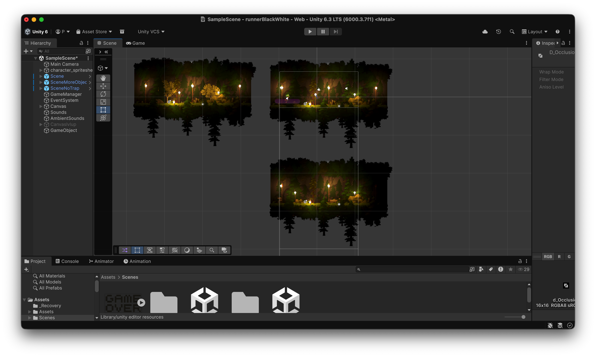
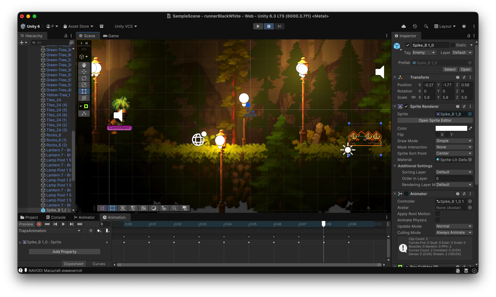

# Runner BlackWhite

Простая 2D endless runner игра на Unity с механикой смены цвета (чёрный / белый).

Персонаж автоматически бежит вперёд, а игрок должен прыгать над препятствиями и переключать цвет, чтобы проходить сквозь стены/объекты нужного цвета. Минималистичный чёрно-белый стиль.


## Технологии

- **Unity** (версия, в которой открывается проект — скорее всего 2021.3 / 2022.3 LTS)
- **C#** — основная логика игры
- **ShaderLab / HLSL** — эффекты смены цвета и пост-обработка

## Как запустить

1. Установи **Unity Hub** и соответствующую версию Unity (рекомендуется LTS)
2. Склонируй репозиторий:

   ```bash
   git clone https://github.com/emo-ang3l/runnerBlackWhite.git

## Особенности

1. Три вида локаций

2. Тригер улучшающий прыжок

3. Ловушка

