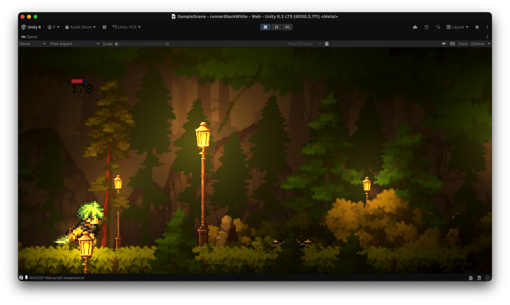

Тут будет текст слева от картинки.


# Runner Ambience

Простая 2D endless runner игра на Unity.

Персонаж автоматически бежит вперёд, а игрок должен прыгать над препятствиями.



## Технологии

- **Unity** (версия, в которой открывается проект — скорее всего 2021.3 / 2022.3 LTS)
- **C#** — основная логика игры
- **ShaderLab / HLSL** — эффекты смены цвета и пост-обработка

## Как запустить

1. Установи **Unity Hub** и соответствующую версию Unity (рекомендуется LTS)
2. Склонируй репозиторий:

   ```bash
   git clone https://github.com/emo-ang3l/runnerAmbience

## Особенности

1. Три вида локаций

2. Тригер улучшающий прыжок

3. Ловушка

